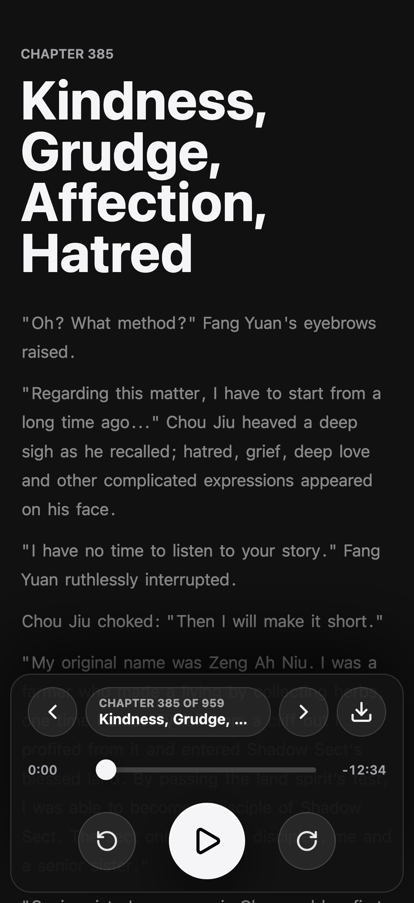
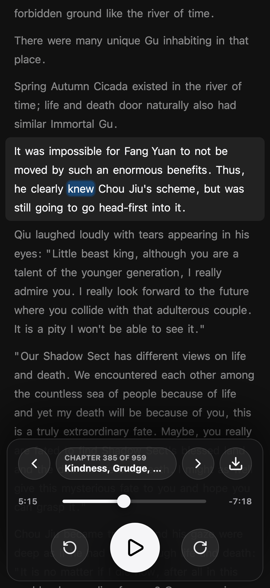
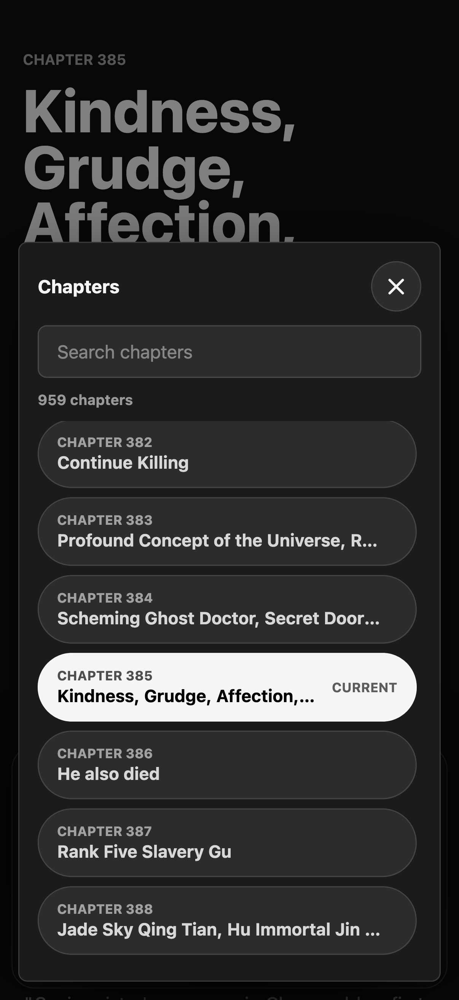

# ri

Audiobook generator and reader powered by Kokoro TTS.

Built around a Kokoro TTS chapter generator and a mobile-first TypeScript
reader for long-form chapter audio, offline downloads, and Cloudflare delivery.

[Live demo](https://ri.pub)

  
  
  

## Highlights

- **Mobile-first playback:** a persistent bottom dock keeps chapter movement,
  seek controls, play/pause, elapsed time, remaining time, and downloads within
  thumb reach.
- **Passage-synced listening:** generated timing data drives current-passage
  highlighting, seek restoration, saved progress, replay, and readable
  autoscroll behavior.
- **Offline by design:** upcoming chapters can be predownloaded automatically,
  cached audio supports range playback, and users can clear downloaded chapter
  assets from the app.
- **Static where it matters:** chapter pages are generated ahead of time with
  embedded timing data, pre-rendered reading markup, hashed app assets, and a
  lazily loaded chapter catalog.
- **Deployment-aware:** Cloudflare Workers serve the app shell while private R2
  audio objects are streamed through validated, content-addressed routes.
- **Behavioral coverage:** Cucumber feature files describe listener workflows,
  and Playwright-backed steps exercise playback, navigation, offline downloads,
  and responsive layout.

## Stack

- **App:** TypeScript, Bun, Zod v4, Lucide icons,
  `scroll-into-view-if-needed`, native media elements, IndexedDB, Cache API,
  and service worker registration.
- **Build and delivery:** Bun scripts, Workbox-generated service worker,
  Wrangler, Cloudflare Workers Static Assets, and Cloudflare R2.
- **Audio generation:** Python, uv, Kokoro TTS, Torch, SoundFile, ffmpeg,
  WebM/Opus primary audio, M4A/AAC fallback audio, and alignment manifests.
- **Testing:** Cucumber, Playwright, TypeScript compile checks, deploy artifact
  validation, and Python compile checks.

## What the App Does

- Opens stable chapter routes such as `/1/` and restores per-chapter progress.
- Lets listeners search, browse, and jump across a large chapter catalog without
  rendering every row at once.
- Keeps passage following in sync with native audio playback, seeking, skip
  back 15 seconds, and skip forward 30 seconds.
- Generates a compact catalog containing source URLs, MIME types, byte sizes,
  hashes, and audio version metadata.
- Serves hashed audio paths such as `/1-0123456789abcdef.webm` and
  `/1-0123456789abcdef.m4a` through a Worker that supports `GET`, `HEAD`, byte
  ranges, immutable cache headers, and clear failure responses.
- Validates generated chapter data and deployment output with Zod before the
  app or deploy scripts trust it.
